# 🛡️ Aawaj: Smart Safety App
### *Your voice against violence*

A personal safety Android application built as a Major Project for the 
Bachelor of Engineering in Computer Engineering at Kathmandu Engineering 
College, Tribhuvan University.

---

## About

Personal safety in Nepal — especially for women — remains a serious 
concern. Aawaj was built to address this gap by combining real-time SOS 
alerting, AI-powered scream detection, and mental health support into one 
mobile application that works even in low connectivity environments.

---

## 🎥 Demo Video

[Watch Project Demo](https://drive.google.com/file/d/1HOtkrs4_8KDYndKAx9-kuzaa9RPxa6yd/view)

## Features

**Emergency & SOS**
- SOS activation via button, voice, trigger-input, and time-based alerts
- Automatic SMS with real-time GPS location sent to trusted contacts
- Works in low or no internet environments via SMS
- Silent background audio recording for evidence collection

**AI-Powered Scream Detection**
- Detects distress sounds using MFCC (Mel-Frequency Cepstral Coefficients)
- Classified using Support Vector Machine (SVM) — 90% accuracy, AUC 0.948
- Automatically triggers SOS alert on scream detection

**Mental Health Chatbot**
- Classifies 14 emotional intent categories using TF-IDF feature extraction
- Soft-voting ensemble of Linear SVC and Logistic Regression — 81.43% accuracy
- Provides breathing exercises, grounding techniques, and guided support
- Crisis escalation with Nepal-specific helpline recommendations

**Phrase Detection**
- Detects emergency phrases in both English and Romanized Nepali
- TF-IDF + Linear SVC/Logistic Regression ensemble — 82.93% accuracy

**Additional Features**
- Real-time map tracking
- Safe Mode for discreet operation during emergencies
- Disguise Mode to hide the app's true purpose on screen

---

## Tech Stack

| Layer | Technology |
|---|---|
| Frontend | Flutter (Dart) |
| Backend | Django (Python) |
| Database | PostgreSQL, Firebase |
| ML — Scream Detection | SVM, MFCC, Scikit-learn, Librosa |
| ML — Chatbot & Phrase Detection | TF-IDF, Linear SVC, Logistic Regression |


---

## 🏗️ System Architecture

Aawaj follows a layered architecture integrating mobile, backend,
machine learning, and emergency response systems.

### Layers

- **Flutter Mobile App**
  - SOS activation
  - Location tracking
  - Audio recording
  - Mental health chatbot
  - Disguise mode

- **Django REST Backend**
  - Authentication
  - API handling
  - Event processing
  - Database communication

- **Machine Learning Layer**
  - Scream detection (MFCC + SVM)
  - Phrase detection (TF-IDF + Linear SVC)
  - Mental health intent classification

- **Emergency Response Layer**
  - GPS location retrieval
  - SMS alert system
  - Trusted contact notification
  - Evidence recording

- **Data Storage**
  - PostgreSQL
  - Firebase
  
## 🔄 System Workflow

User Trigger
    ↓
AI Detection / Manual SOS
    ↓
Location + Audio Capture
    ↓
Backend Processing
    ↓
SMS Alert to Trusted Contacts

## 📸 Screenshots

<table>
  <tr>
    <td align="center">
      <b>Welcome Screen</b><br/>
      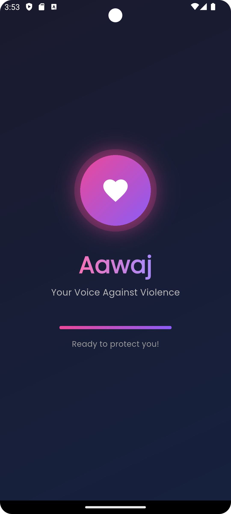
    </td>
    <td align="center">
      <b>Home Dashboard</b><br/>
      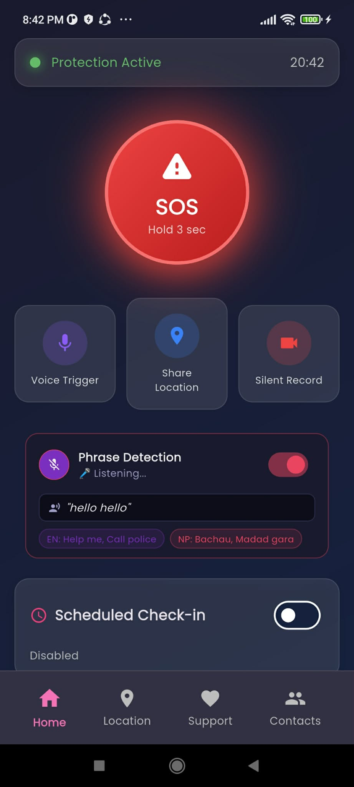
    </td>
    <td align="center">
      <b>SOS Trigger</b><br/>
      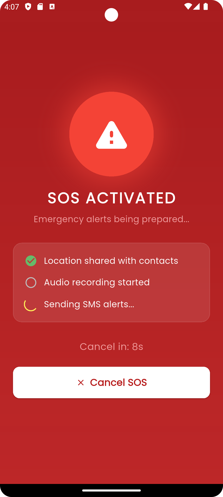
    </td>
  </tr>

  <tr>
    <td align="center">
      <b>SOS Cancelled</b><br/>
      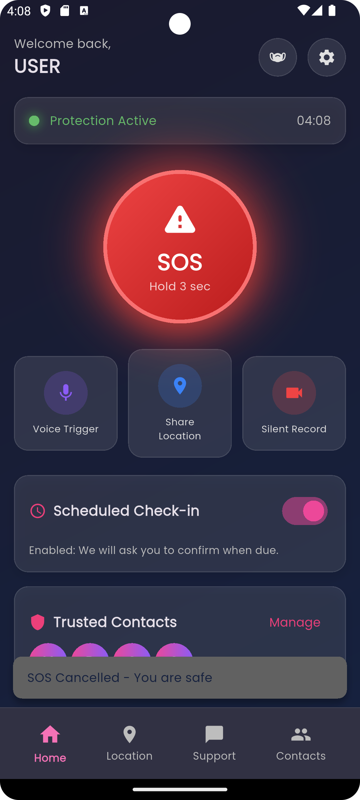
    </td>
    <td align="center">
      <b>SMS Sent Alert</b><br/>
      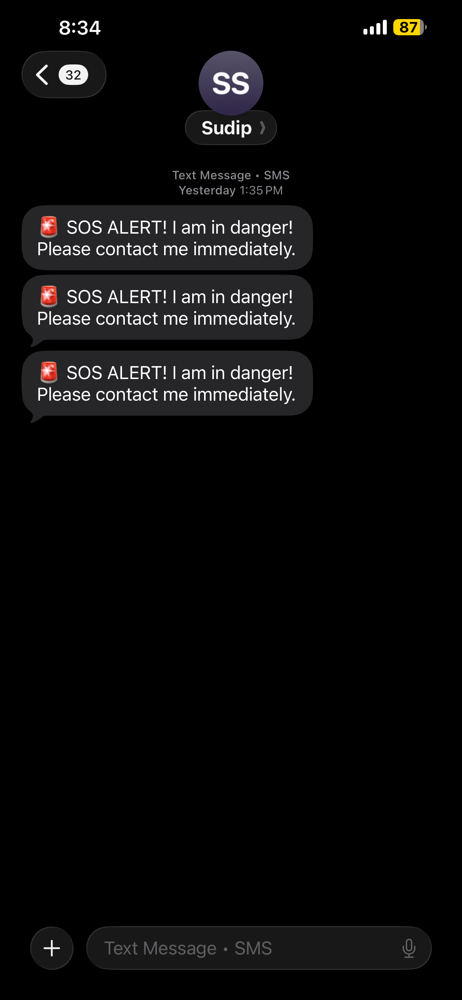
    </td>
    <td align="center">
      <b>Live Location Sharing</b><br/>
      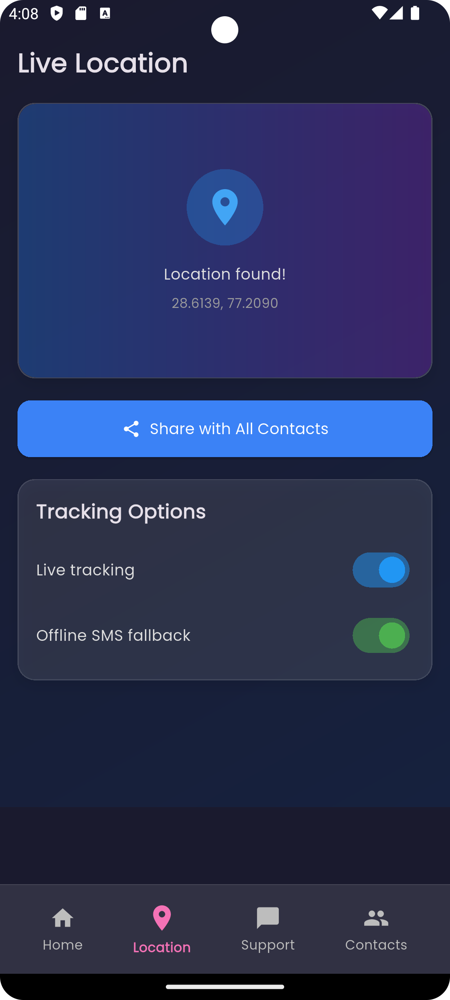
    </td>
  </tr>

  <tr>
    <td align="center">
      <b>Location Permission</b><br/>
      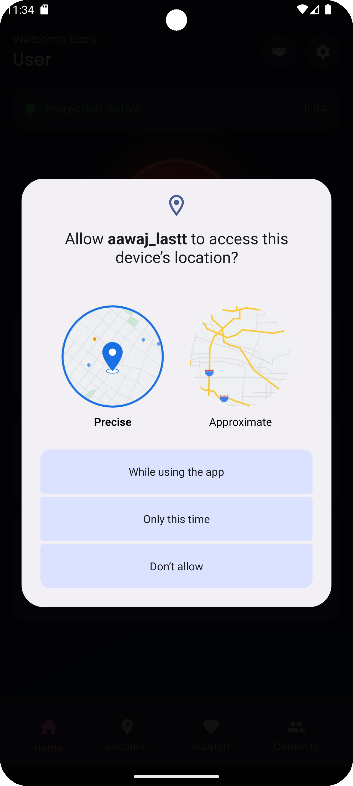
    </td>
    <td align="center">
      <b>Scheduled Check-In</b><br/>
      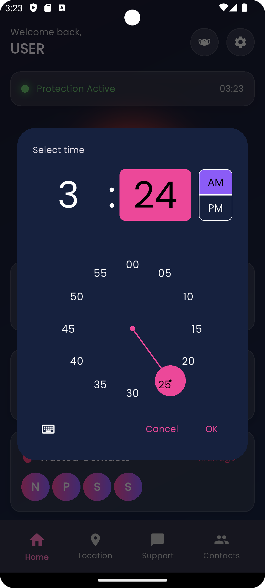
    </td>
    <td align="center">
      <b>Check-In Message</b><br/>
      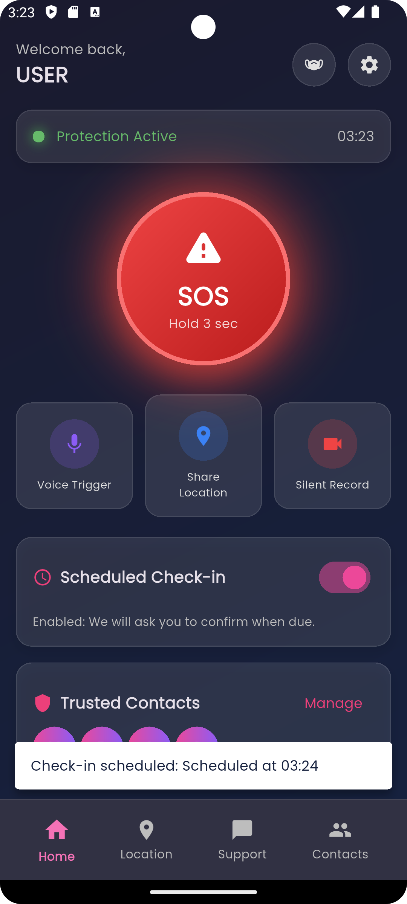
    </td>
  </tr>

  <tr>
    <td align="center">
      <b>Audio Recording</b><br/>
      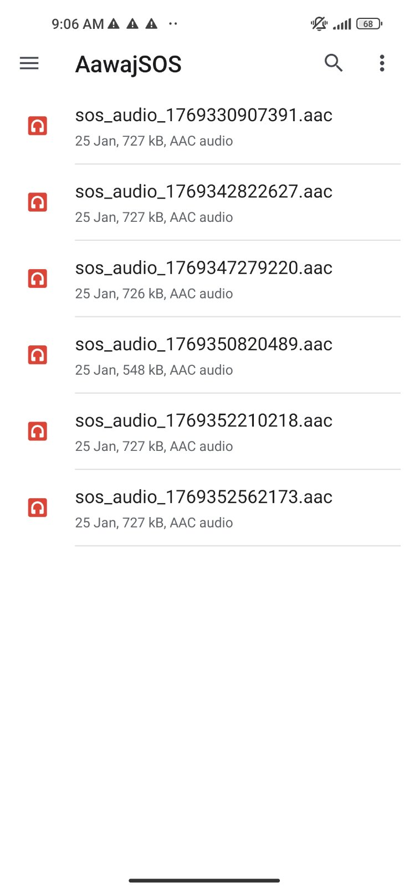
    </td>
    <td align="center">
      <b>Disguise Mode</b><br/>
      
    </td>
    <td align="center">
      <b>Safe / Unsafe Status</b><br/>
      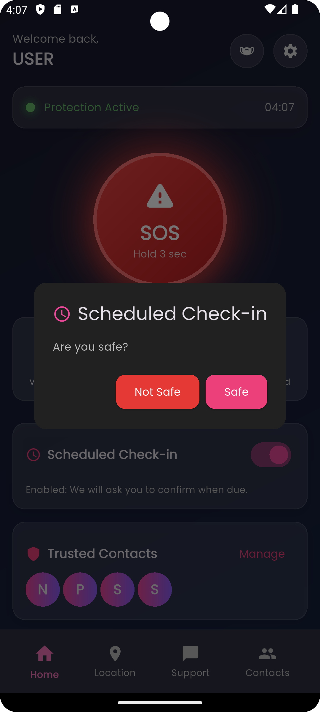
    </td>
  </tr>

  <tr>
    <td align="center">
      <b>Phrase Detection Trigger 1</b><br/>
      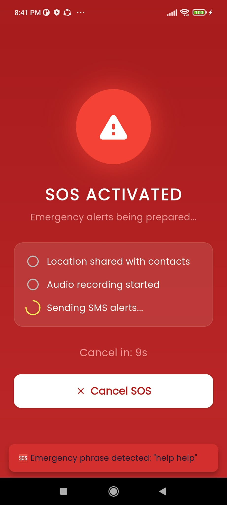
    </td>
    <td align="center">
      <b>Phrase Detection Trigger 2</b><br/>
      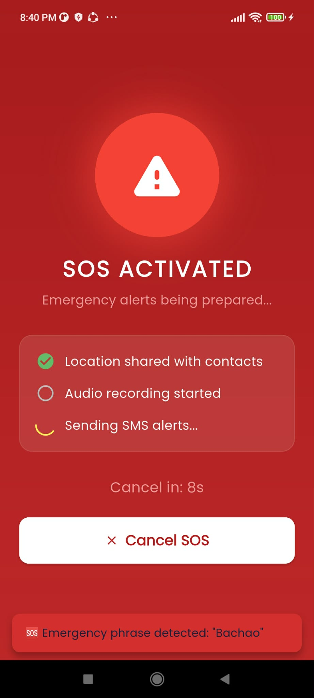
    </td>
  </tr>
</table>

---

## 🧠 Mental Health Chatbot

<table>
  <tr>
    <td align="center">
      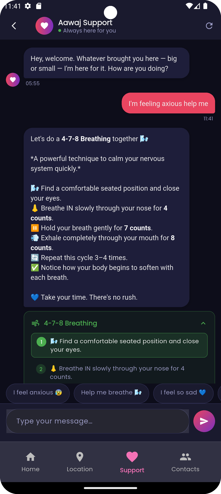
    </td>
    <td align="center">
      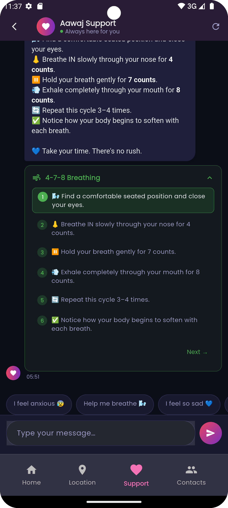
    </td>
    <td align="center">
      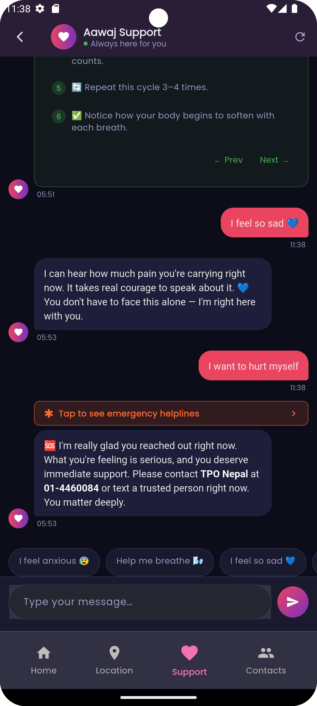
    </td>
  </tr>
</table>

---

## Getting Started

**Prerequisites**
- Flutter SDK 3.41.5+
- Python 3.10+
- PostgreSQL
- Firebase account

**Frontend Setup**
```bash
git clone https://github.com/Nehu2021/aawaj_smart_safety_app.git
cd aawaj_smart_safety_app
flutter pub get
flutter run
```

**Backend Setup**
```bash
cd backend
pip install -r requirements.txt
python manage.py migrate
python manage.py runserver
```

---

## Team

Developed as a Major Project by a team of four students at 
Kathmandu Engineering College.

| Name |
|------|
| Neha Khatri |
| Prasiddha Raj Gautam |
| Sudip Shrestha |
| Susan Baral |

**Supervisor:** Assoc. Prof. Er. Sharad Neupane

---

## My Contributions

As one of four team members, I was personally responsible for:

- **Flutter frontend** — designed and built the complete mobile UI
- **Mental health chatbot** — trained TF-IDF + soft-voting ensemble model 
  achieving 81.43% accuracy across 14 emotional intent categories, 
  including crisis escalation with Nepal-specific helpline integration
- **Phrase detection system** — built emergency phrase classifier for 
  English and Romanized Nepali achieving 82.93% accuracy
- **ML integration** — connected all trained models to Django REST backend 
  and Flutter frontend end-to-end

---

## Links

[LinkedIn](https://www.linkedin.com/in/neha-khatry/) · 
[GitHub](https://github.com/neha-khatry)
